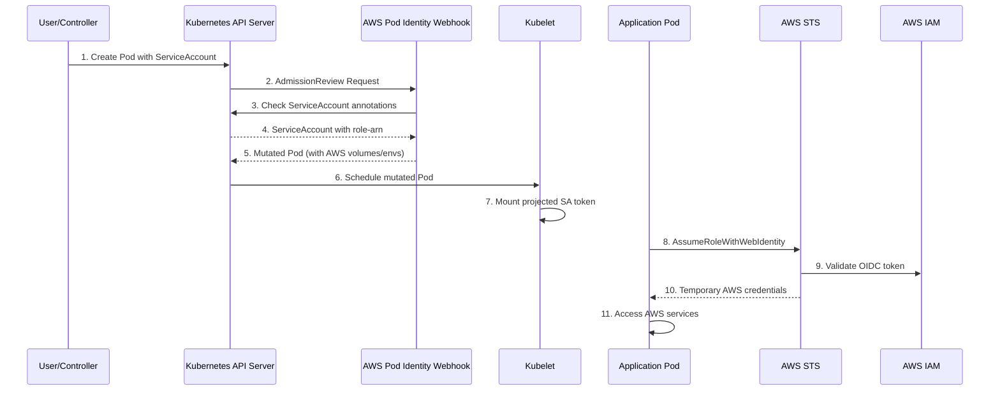

# EKS Pod Identity Webhook

[](https://golang.org/)
[](LICENSE)
[](https://github.com/mondu-ai/eks-pod-identity-webhook/pkgs/container/eks-pod-identity-webhook)
[](https://goreportcard.com/report/github.com/mondu-ai/eks-pod-identity-webhook)

A Kubernetes mutating admission webhook that enables pods running in non-EKS clusters (such as GKE, AKS, or on-premises) to seamlessly assume AWS IAM roles using the same patterns as EKS IAM Roles for Service Accounts (IRSA).

## 🚀 Features

- **EKS IRSA Compatibility**: Uses the same `eks.amazonaws.com/role-arn` annotation pattern as EKS
- **Multi-Platform Support**: Works with GKE, AKS, on-premises, and any Kubernetes cluster with OIDC
- **Automatic Injection**: Automatically injects AWS credentials and volumes into pods
- **Security First**: Runs with non-root user, follows security best practices
- **Cloud Native**: Designed for cloud-native environments with proper health checks
- **Observable**: Comprehensive logging with configurable levels

## 📋 Table of Contents

- [How It Works](#how-it-works)
- [Prerequisites](#prerequisites)
- [Architecture](#architecture)
- [License](#license)

## 🔧 How It Works

The webhook intercepts pod creation requests and automatically injects the necessary AWS credentials when:

1. **Pod Detection**: A pod is created/updated with a ServiceAccount
2. **Annotation Check**: The ServiceAccount has the `eks.amazonaws.com/role-arn` annotation
3. **Automatic Injection**: The webhook injects:
   - AWS IAM role ARN environment variable
   - Projected ServiceAccount token volume (audience: `sts.amazonaws.com`)
   - AWS SDK configuration environment variables
   - Token file path for Web Identity Token authentication

This enables the AWS SDK to automatically assume the specified IAM role using OpenID Connect (OIDC) federation.

## ⚙️ Prerequisites

### 1. Kubernetes Cluster with OIDC

Your Kubernetes cluster must be configured as an OIDC Identity Provider. Most managed Kubernetes services support this:

- **GKE**: Enable Workload Identity
- **AKS**: Enable OIDC Issuer
- **EKS**: OIDC is enabled by default
- **On-premises**: Configure OIDC issuer

### 2. AWS IAM OIDC Provider

Configure your Kubernetes cluster as an OIDC Identity Provider in AWS IAM:

```bash
# Get your cluster's OIDC issuer URL
OIDC_ISSUER=$(kubectl get --raw /.well-known/openid_configuration | jq -r '.issuer')

# Create OIDC Identity Provider in AWS
aws iam create-open-id-connect-provider \
    --url $OIDC_ISSUER \
    --thumbprint-list $(echo | openssl s_client -servername $(echo $OIDC_ISSUER | cut -d'/' -f3) -connect $(echo $OIDC_ISSUER | cut -d'/' -f3):443 2>/dev/null | openssl x509 -fingerprint -noout -sha1 | cut -d'=' -f2 | tr -d ':') \
    --client-id-list sts.amazonaws.com
```

### 3. IAM Role Configuration

Create an IAM role with a trust policy that allows your Kubernetes ServiceAccounts to assume it:

```json
{
  "Version": "2012-10-17",
  "Statement": [
    {
      "Effect": "Allow",
      "Principal": {
        "Federated": "arn:aws:iam::ACCOUNT_ID:oidc-provider/YOUR_OIDC_ISSUER"
      },
      "Action": "sts:AssumeRoleWithWebIdentity",
      "Condition": {
        "StringEquals": {
          "YOUR_OIDC_ISSUER:sub": "system:serviceaccount:NAMESPACE:SERVICE_ACCOUNT_NAME",
          "YOUR_OIDC_ISSUER:aud": "sts.amazonaws.com"
        }
      }
    }
  ]
}
```

## 🏛️ Architecture



### Injected Resources

The webhook automatically injects the following into matching pods:

**Volume:**
```yaml
- name: aws-token
  projected:
    sources:
    - serviceAccountToken:
        audience: sts.amazonaws.com
        expirationSeconds: 3600
        path: token
```

**Volume Mount:**
```yaml
- name: aws-token
  mountPath: /var/run/secrets/eks.amazonaws.com/serviceaccount
  readOnly: true
```

**Environment Variables:**
```yaml
- name: AWS_ROLE_ARN
  value: arn:aws:iam::123456789012:role/YourRole
- name: AWS_WEB_IDENTITY_TOKEN_FILE
  value: /var/run/secrets/eks.amazonaws.com/serviceaccount/token
- name: AWS_REGION
  value: us-west-2
- name: AWS_DEFAULT_REGION
  value: us-west-2
- name: AWS_ROLE_SESSION_NAME
  value: pod-name
```

## 📄 License

This project is licensed under the MIT License - see the [LICENSE](LICENSE) file for details.
